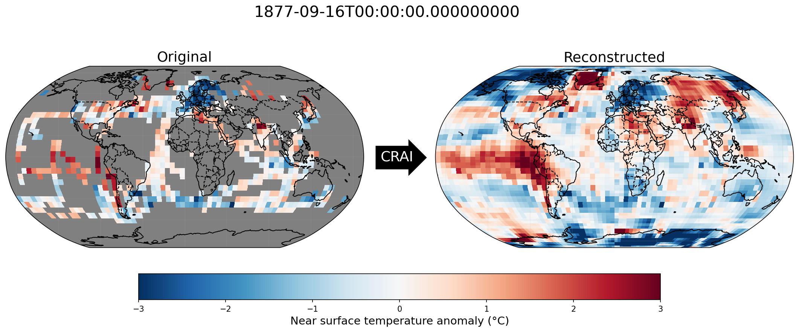

# Demo for climatereconstructionAI

The present demo aims at giving an example of the climate dataset infilling (**evaluation** process).

`climatereconstructionAI` must be installed first (see [README](https://github.com/FREVA-CLINT/climatereconstructionAI/tree/clint#readme))

## Structure

The `demo` folder contains:
- a directory `inputs` with the following sub-directories:
  - `test-large`: contains the climate dataset to be infilled:
    - `tas_hadcrut_187709_189308.nc` is a netCDF file containing the HadCRUT4 monthly global temperature anomaly (in ºC) for two dates (September 1877 and August 1893) with a spatial resolution of 2.5º×5º (lat×lon). The full dataset can be downloaded from the UK MET office ([HadCRUT4](https://www.metoffice.gov.uk/hadobs/hadcrut4/data/current/download.html))
- a text file `demo_args.txt` containing the input arguments of the example
- a directory `outputs` where the output files will be stored
- a directory `images` containing some visualizations of the output files


## Usage

The paths for the input and output directories defined in `demo_args.txt` are relative to the `demo` directory. Hence, the software should be run in the current directory.

### CLI

```bash
crai-evaluate --load-from-file demo_args.txt
```

### Python module

```python
from climatereconstructionai import evaluate
evaluate("demo_args.txt")
```

## Outputs

### The files

Each evaluation produces 5 netCDF files and 2 png files contained in the `outputs` folder:
- `demo_gt.nc` corresponds to the original dataset
- `demo_mask.nc` contains the masks corresponding to the missing values
- `demo_image.nc` is `demo-#_gt.nc` after applying the masks `demo-#_mask.nc`
- `demo_output.nc` is the dataset where all values (valid and missing values) are being infilled)
- `demo_infilled.nc` is the **infilled dataset**: it is the original dataset `demo_gt.nc` where the missing values have been replaced by the values from `demo_output.nc`
- `demo_masked_gt_0.png` is a plot of the first timestep of `demo_gt.nc`
- `demo_infilled_0.png` is a plot of the first timestep of `demo_infilled.nc`


### Visualization

We can visualize the infilling by comparing the original and the infilled datasets for a specific date (here September 1877):


