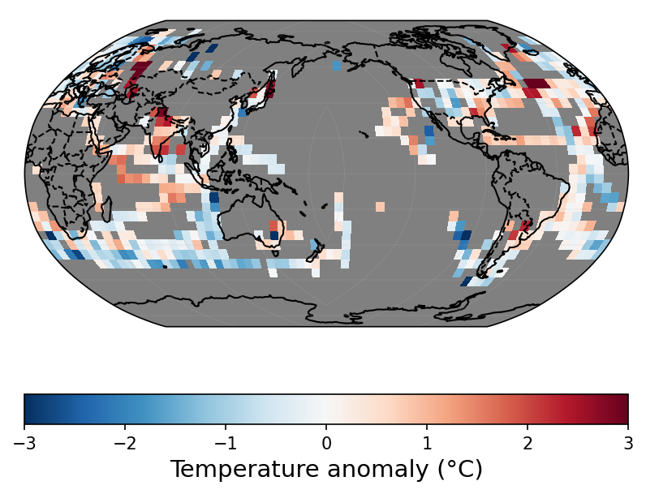
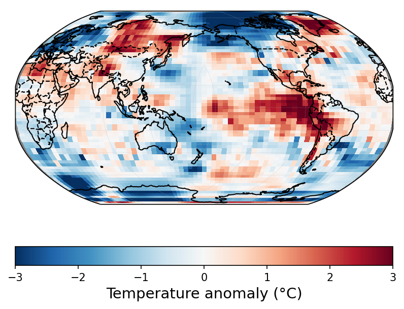

# Demo for climatereconstructionAI

The present demo aims at giving an example of the climate dataset infilling (**evaluation** process).

`climatereconstructionAI` must be installed first (see [README](https://github.com/FREVA-CLINT/climatereconstructionAI/tree/clint#readme))

## Structure

The `demo` folder contains:
- a directory `inputs` with the following sub-directories:
  - `test-large`: contains the climate datasets to be infilled:
    - `tas_hadcrut_185001-201812.nc` is a netCDF file containing the HADCRUT4 monthly global temperature anomaly from 1850 to 2018 (2028 time steps in total) with a spatial resolution of 2.5º×5º (lat×lon)
  - `masks`: contains the masks used for the missing values (optional)
- a text file `demo-1_args.txt` containing the input arguments
- a directory `outputs` where the output files will be stored
- a directory `images` containing some visualizations of the output files


## Usage

The paths for the input and output directories defined in `demo-1_args.txt` are relative to the `demo` directory. Hence, the software should be called in the `demo` directory.

### CLI

```bash
crai-evaluate --load-from-file demo-1_args.txt
```

### Python module

```python
from climatereconstructionai import evaluate
evaluate("demo-1_args.txt")
```

## Outputs

### The files

The evaluation produces 5 netCDF files contained in the `output` folder:
- `demo-1_gt.nc` corresponds to the original dataset
- `demo-1_mask.nc` contains the masks corresponding of the missing values
- `demo-1_image.nc` is `demo-1_gt.nc` after applying the masks `demo-1_mask.nc`
- `demo-1_output.nc` is the infilled dataset (all values being infilled)
- `demo-1_output_comp.nc` is the **composite output dataset**: it is the original dataset `demo-1_gt.nc` where the missing values have been replaced by the values from `demo-1_output.nc`

### Visualization

We can visualize the infilling by comparing the original and the composite datasets for a specific date (here July 1877):

| Original dataset | Composite dataset |
| --------------------- | -------------------------- |
  |  
